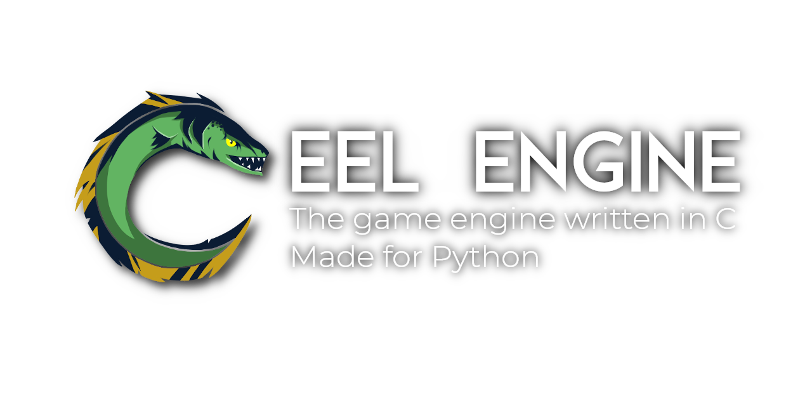

---

### Eel Engine
A graphics engine written in C, Python and Cython. With it, you can write games in Python, but with the speed and efficiency of C.

---

#### Compiling
In order to compile it, you'll need to meet a few requirements:
- [Python](https://python.org) 3.8+ and your Python version's equivalent development libraries
- [Cython](https://cython.org/)
- [NumPy](https://numpy.org/)
- Any [package](https://www.mesa3d.org/) that includes [OpenGL](https://www.opengl.org/) (Depends on your graphics driver)
- [GLEW](http://glew.sourceforge.net/)
- [GLFW3](https://www.glfw.org/) >= 3.3-1
- [FreeType2](https://www.freetype.org/)

Check out how to install them [at the dependencies section](###Dependencies), at the bottom of the page.

After meeting the requirements, be sure to install [Premake5](https://premake.github.io/) and then run the following commands:
```sh
premake5 gmake2
make
```

Optionally, you may install it with
```sh
./install.sh
```

Windows (64bit) users will have to follow the instructions listed in [here](Windows-compile/Windows.md).
**Please note**, however, that compiled binaries for Windows are available [here](https://github.com/Syndelis/eel-engine/releases) and thus you should only compile if you want to tinker with the source code.

---

#### Usage
To get started, you'll need to import the Eel class from the `eel` module and instantiate it.
```python
>>> from eelengine import Eel
>>> window = Eel() # Initializes a new window (doesn't open it yet)
```
With that done, you'll have a new window container ready to be open and drawn to. The next step is to actually draw something in it. In order to do that, we'll import a basic shape from the `figure` module and use it on the `draw()` method of our instantiated window.
```python
>>> from eelengine.figure import drawRect
>>> # This is what's called a decorator
>>> # You don't need to worry about it too much,
>>> # just know it makes the function run every frame of the game
>>> @window.draw
>>> def drawCoolRectangle(eel):
>>>     # Draws a 100x200 rectangle at x, y = (20, 20)
>>>     drawRect(20, 20, 100, 200, target=eel)
```
That function will be executed every time the `draw()` method of our window is called. Now all that's left is to finally open our window and draw that rectangle to it.
```python
>>> window.run()
```
You should now see the white outline of a rectangle in a 640x360 window. That's a pretty basic example, but you can check out more on the [/examples/](examples) directory. I recommend checking out [snake.py](examples/snake/snake.py) if you want to learn some basic stuff quickly.

---
### Dependencies

- Installing for Ubuntu derivatives:
    ```sh
    apt install python3 python3-dev python3-pip libglew2.1 libglew-dev libglfw3 libglfw3-dev libfreetype6 libfreetype6-dev

    git submodule update --init --recursive

    pip3 install cython numpy
    ```

- Installing for Arch Linux
    ```sh
    pacman -S python python-pip glew glfw-$XDG_SESSION_TYPE freetype2

    git submodule update --init --recursive

    pip3 install cython numpy
    ```

    PS: Repositories required for packages listed above: `community` and `extra`

---

#### Documentation
Check out [the official documentation](documentation.md) (Constantly outdated, sorry! Try looking at the examples more often)

---

Logo by the very talented Sininsi#7655, at Discord.

Fonts used: [Moderne Sans](https://www.behance.net/gallery/15574861/Moderne-Sans-Free-Typeface), [Montserrat](https://fonts.google.com/specimen/Montserrat)